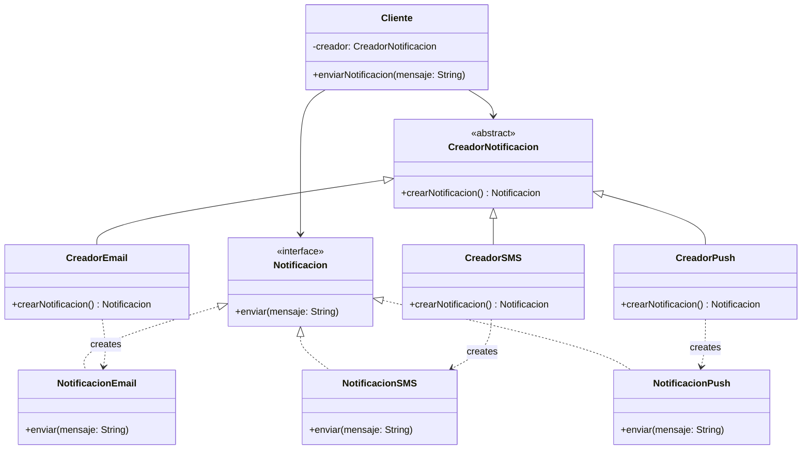

# Factory Method

**Autor:** Adrián Pérez Pérez

## Descripción

Ejercicio académico del patrón de diseño **Factory Method** implementado en Java. El sistema simula un servicio de envío de notificaciones que puede operar con diferentes canales sin que el código cliente conozca las clases concretas.

## Estructura del Proyecto

```
src/
├── Notificacion.java          # Interfaz común
├── NotificacionEmail.java     # Implementación Email
├── NotificacionSMS.java       # Implementación SMS
├── NotificacionPush.java      # Implementación Push
├── CreadorNotificacion.java   # Clase abstracta (Factory)
├── CreadorEmail.java          # Creador concreto Email
├── CreadorSMS.java            # Creador concreto SMS
├── CreadorPush.java           # Creador concreto Push
├── Cliente.java               # Cliente que usa el factory
└── Main.java                  # Demostración
```

## Diagrama del Patrón



## Compilación y Ejecución

```bash
cd src
javac *.java
java Main
```

## Salida Esperada

```
=== Sistema de Notificaciones - Factory Method ===

Enviando Email: [Bienvenido a nuestra plataforma]
Enviando SMS: [Tu código de verificación es 1234]
Enviando Push: [Tienes una nueva solicitud de amistad]
```

## Patrón Factory Method

El patrón **Factory Method** define una interfaz para crear un objeto, pero son las subclases las que deciden qué clase concretas instanciar. Esto permite extender el sistema con nuevos canales de notificación sin modificar el código cliente existente.

**Beneficios:**
- **Bajo acoplamiento:** El cliente desconoce las clases concretas.
- **Extensibilidad:** Agregar un nuevo canal solo requiere crear dos nuevas clases.
- **Principio de responsabilidad única:** La creación de objetos está centralizada.